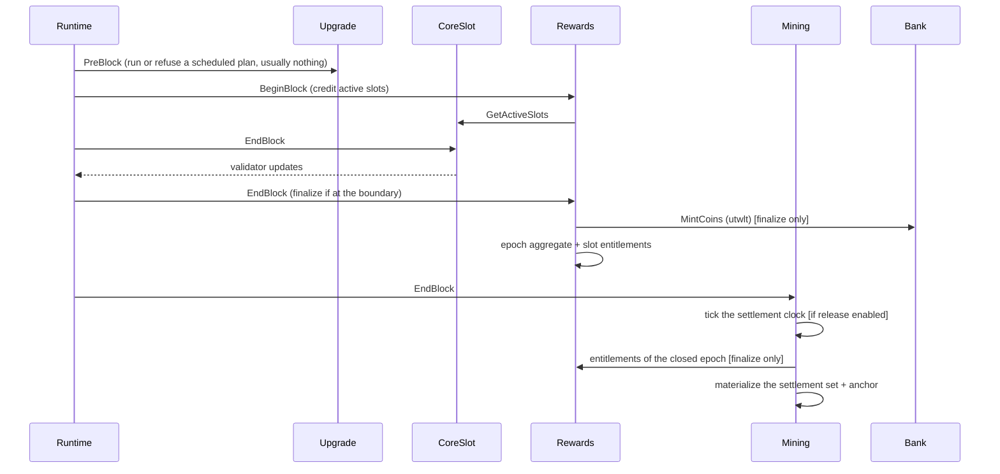

# Block Lifecycle

How a block flows through the modules. The order is fixed in `app/config.go`:

| Hook | Order |
|---|---|
| PreBlock | `upgrade`, `auth` |
| BeginBlock | `rewards` |
| EndBlock | `coreslot`, `rewards`, `mining` |

## PreBlock — `upgrade`, `auth`

`x/upgrade` runs before anything else in the block. If a plan scheduled by the
CoreSlot authority names this height, a node running the new binary runs the
registered handler once and continues; a node still on the old binary refuses the
block and stops at this height. Nothing happens on any other block. See
[Upgrade & Export/Import](../operators/upgrade-and-export-import.md). `auth` follows
with the SDK's own pre-blocker. Neither touches rewards or settlement state.

## BeginBlock — `rewards`

CoreSlot and mining have no BeginBlocker. The rewards `BeginBlock`:

1. loads `RewardsState` and the current epoch config;
2. reads the active CoreSlot set (`GetActiveSlots`);
3. validates every returned slot is active (fail-closed on a contract violation);
4. increments the `(current_epoch, slot)` active-block counter for each.

Pausing does not stop epoch time: numbering advances and epochs still finalize. A
paused block is not reward-enabled, so it credits nothing.

## Transaction processing

Standard Cosmos message handling: CoreSlot lifecycle, authority and upgrade messages,
rewards parameter and pause messages
([transactions](../rewards/transactions.md)), and settlement chunks and
finalizations ([Settlement](../rewards/settlement.md)). Authority checks live in the
message servers. A settlement transaction compares against the settlement clock as it
stood at the end of the previous block.

## EndBlock — `coreslot`, `rewards`, `mining`

1. **CoreSlot** resolves the validator set for the block and is the **sole
   validator-update emitter**.
2. **Rewards** loads state, the current epoch config, and params. If this block is
   the epoch's canonical last, it **finalizes the epoch** in one cache context:
   mint → pool → allocate → write the epoch aggregate and one slot entitlement per
   eligible slot → advance carry-forward and cumulative emitted; then it promotes any
   reward configuration scheduled for the epoch that follows. Finalization is
   unconditional at the boundary — a pause does not defer it — and it does **not**
   advance the epoch counter: the next epoch becomes current at its own first
   BeginBlock, so a query at the closing height sees
   `last_finalized_epoch == current_epoch`.
3. **Mining**, in one cache context: ticks the settlement clock if the block's
   beginning-of-block pause state permitted release; if an epoch closed in this
   block, materializes its settlement set (one `OPEN` settlement per entitlement,
   anchored to the clock) and promotes any distribution-mode or settlement-parameter
   change scheduled for the epoch that follows. No value moves here: mining has no
   bank keeper.

## Fail-closed

Rewards `BeginBlock`/`EndBlock` and mining `EndBlock` each run in a cache context
that commits only on full success. If any step errors, the error propagates through
`FinalizeBlock` and the **block does not commit** — no partial state. See
[Security & Failure Modes](../rewards/security-and-failure-modes.md).

## Epoch boundary

The configured end height is
`current_epoch_start_height + epoch_length_blocks − 1` using the **current epoch
snapshot's** length (not the latest params). The current epoch always finalizes
under its own snapshot; queued params apply to the next epoch. See
[Epoch Lifecycle](../rewards/epoch-lifecycle.md).
