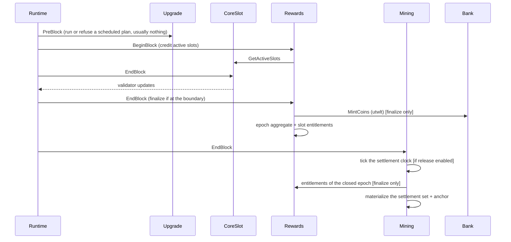

# Block Lifecycle

How a block flows through the modules. The order is fixed in `app/config.go`:

| Hook | Order |
|---|---|
| PreBlock | `upgrade`, `auth` |
| BeginBlock | `rewards` |
| EndBlock | `coreslot`, `rewards`, `mining` |

## PreBlock — `upgrade`, `auth`

`x/upgrade` runs before anything else in the block. If a plan scheduled by the
CoreSlot authority names this height, a node running the new binary runs the
registered handler once and continues; a node still on the old binary refuses the
block and stops at this height. On other blocks it does nothing, with two
exceptions: a node whose binary already contains the handler for a pending plan
halts at every block before the plan's height (so do not swap early), and on its
first block after a restart a node refuses to run if the handler of the last
completed upgrade is missing from its binary. See
[Upgrade & Export/Import](../operators/upgrade-and-export-import.md). `auth` follows
with the SDK's own pre-blocker. Outside an upgrade height neither touches rewards or
settlement state; at the height, the handler's migrations may.

## BeginBlock — `rewards`

CoreSlot and mining have no BeginBlocker. The rewards `BeginBlock`, in one cache
context:

1. opens the next epoch if this block starts one — the epoch counter advances here,
   consuming any scheduled epoch configuration and resetting the open counters;
2. applies a pause or resume transition due at this height, before anything is
   sampled;
3. reads the state, the pause flag, and the active CoreSlot set (`GetActiveSlots`),
   validating that every returned slot is active (fail-closed on a contract
   violation);
4. increments the `(current_epoch, slot)` active-block counter for each slot, when
   accrual is enabled.

Pausing does not stop epoch time: numbering advances and epochs still finalize. A
paused block is not reward-enabled, so it credits nothing.

## Transaction processing

Standard Cosmos message handling: CoreSlot lifecycle, authority and upgrade messages,
rewards parameter and pause messages
([transactions](../rewards/transactions.md)), and settlement chunks and
finalizations ([Settlement](../rewards/settlement.md)). Authority checks live in the
message servers. A settlement transaction compares against the settlement clock as it
stood at the end of the previous block.

## EndBlock — `coreslot`, `rewards`, `mining`

1. **CoreSlot** resolves the validator set for the block and is the **sole
   validator-update emitter**.
2. **Rewards** loads state, the current epoch config, and params. If this block is
   the epoch's canonical last, it **finalizes the epoch** in one cache context:
   mint → pool → allocate → write the epoch aggregate and one slot entitlement per
   eligible slot → advance carry-forward and cumulative emitted; then it promotes any
   reward configuration scheduled for the epoch that follows. Finalization is
   unconditional at the boundary — a pause does not defer it — and it does **not**
   advance the epoch counter: the next epoch becomes current at its own first
   BeginBlock, so at the closing height `epoch-info` still reports
   `current_epoch = N` while `epoch-reward N` already exists.
3. **Mining**, in one cache context: ticks the settlement clock if the block's
   beginning-of-block pause state permitted release; if an epoch closed in this
   block, materializes its settlement set (one `OPEN` settlement per entitlement,
   anchored to the clock) and promotes any distribution-mode or settlement-parameter
   change scheduled for the epoch that follows. No value moves here: mining has no
   bank keeper.

## Fail-closed

Rewards `BeginBlock`/`EndBlock` and mining `EndBlock` each run in a cache context
that commits only on full success. If any step errors, the error propagates through
`FinalizeBlock` and the **block does not commit** — no partial state. See
[Security & Failure Modes](../rewards/security-and-failure-modes.md).

## Epoch boundary

The end height of epoch N is `current_epoch_start_height + epoch_length_blocks − 1`,
the block before epoch N+1 begins; it is derived from the epoch-configuration
history that governs the epoch, fixed when the epoch opened, and never stored.
`epoch_length_blocks` in the parameters is frozen genesis data that no transaction
changes, so a parameter update never moves a boundary. See
[Epoch Lifecycle](../rewards/epoch-lifecycle.md).
