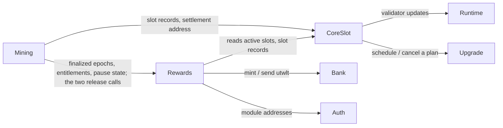

# Module Map

The runtime modules and how they relate. Full architecture in
[Chain → Architecture](../chain/architecture.md).

## Modules in the app

| Module | Lifecycle interface | Emits validator updates? |
|---|---|---|
| `auth`, `bank`, `consensus`, `upgrade` | standard (`upgrade` and `auth` run in PreBlock) | no |
| `x/coreslot` | **legacy** `module.HasABCIEndBlock` | **yes** (sole emitter) |
| `x/rewards` | **modern** `appmodule.HasBeginBlocker` / `HasEndBlocker` | no |
| `x/mining` | **modern** `appmodule.HasEndBlocker` (no BeginBlocker) | no |

Omitted: `staking`, `distribution`, `slashing`, `governance`, `mint`.

## Dependencies

- Rewards depends on CoreSlot (read-only), bank, and auth. CoreSlot does **not**
  depend on rewards.
- Mining depends on rewards and CoreSlot, both read-only except for the two
  rewards methods that move value out of an entitlement. Nothing depends on
  mining, and mining holds no bank keeper.
- `x/upgrade`'s own messages are bound to an authority with no key; the only way
  to schedule or cancel a plan is CoreSlot's `ScheduleUpgrade` / `CancelUpgrade`,
  gated on the CoreSlot authority.
- Keepers take interface-typed dependencies (`AccountKeeper`, `BankKeeper`,
  `CoreSlotKeeper`, `RewardsKeeper`) — no concrete app imports, no cycles.

## Lifecycle order (`app/config.go`)

| Hook | Order |
|---|---|
| `PreBlockers` | `["upgrade", "auth"]` |
| `BeginBlockers` | `["rewards"]` |
| `EndBlockers` | `["coreslot", "rewards", "mining"]` |
| `InitGenesis` | `["upgrade", "auth", "bank", "consensus", "coreslot", "rewards", "mining"]` |

CoreSlot runs first at EndBlock and remains the only validator-update emitter;
rewards finalizes the epoch's accounting; mining then materializes that epoch's
settlement set in the same block. Rewards and mining use modern error-only
lifecycle methods. See [Block Lifecycle](../chain/lifecycle.md).

## Cross-module interfaces

**Rewards → CoreSlot.** Exactly four read methods: `GetActiveSlots`, `GetSlot`,
`GetAuthority`, `GetEmergencyAuthority`. `GetRewardWeight` is deliberately absent.

**Mining → rewards.** Reads: the finalized epoch record, the entitlements of an
epoch, one entitlement, epoch start/end heights and length, and whether release is
enabled. Writes, both performed by rewards against its own entitlement ceiling:
`PayEntitlement` (a participant chunk) and `PayEntitlementRemainderToOperator`
(finalization). Every method that moves value lives in rewards, not in mining.

**Mining → CoreSlot.** `GetSlot` (the settlement address that may submit a slot's
chunks), `GetActiveSlots`, and `SelectionPolicyAtHeight`.
