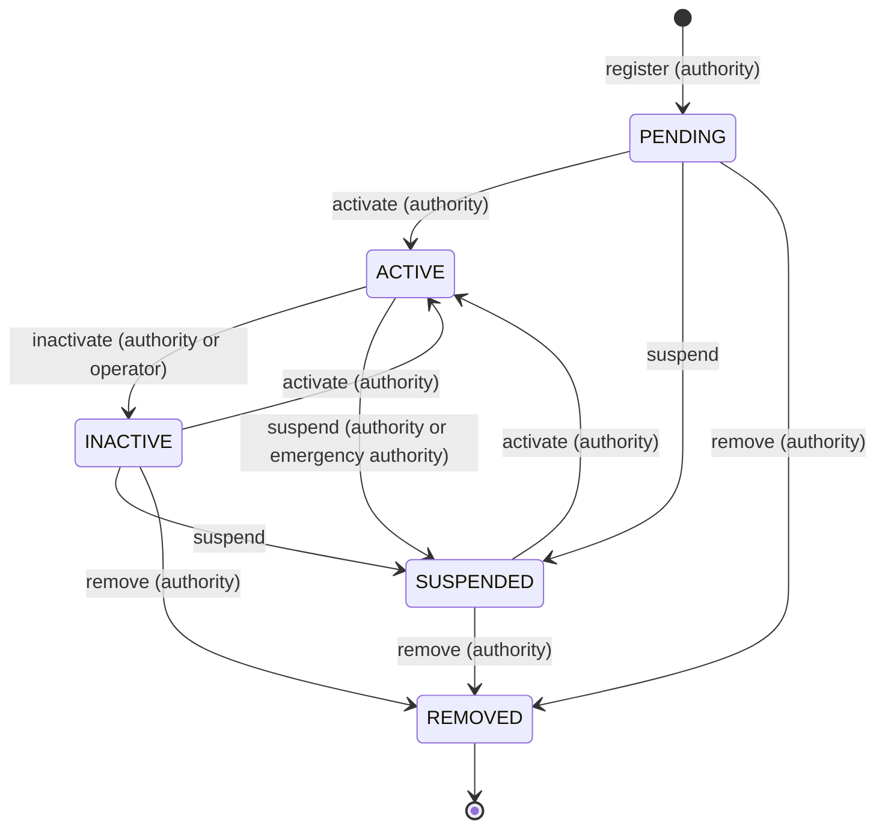

# Validator Operations

How a validator is admitted, how its slot moves through its lifecycle, who signs each
step, and what the node has to do alongside. Validators are admitted by the chain's
authority, not by stake: there is no staking, delegation, jailing or slashing. The
signer rules are enforced by the message servers and summarised on the
[Authority & Emergency Guide](authority-and-emergency-guide.md#who-can-do-what); the
commands are on the [CLI Reference](../reference/cli.md#coreslot).

## Becoming a validator

Run a full node first ([Node Operator Guide](node-operator-guide.md#joining-an-existing-network)),
then give the authority four things:

- your **operator address** — the account that will sign your slot's own
  transactions (payout, settlement address, metadata, policy, self-inactivation);
- a **payout address** — where each epoch's remainder is released; snapshotted into every
  entitlement at the epoch's close, so a change affects later epochs only;
- a **settlement address** — the account that signs your slot's participant payouts
  ([Settlement](../rewards/settlement.md#chunks)). It is mandatory and has no default,
  and it carries the same exposure as the entitlements it can pay out: custody it as a
  hot operational credential, separate from the operator key if you can;
- your node's **consensus public key**, base64: `twilightd comet show-validator | jq -r .key`.

Any of the three addresses may be the same account; a module account is refused for any
of them. The authority then registers and activates the slot:

```bash
twilightd coreslot register <operator> <payout> <settlement> <consensus-pubkey-base64> <moniker> \
  [--selection-rate-bps 2500] [--max-selected-participants 10] --from <authority> ...
twilightd coreslot activate <slot-id> --from <authority> ...
```

Registration creates the slot `PENDING` with power 0, its reward-weight row and its
initial selection policy; activation makes it `ACTIVE` at `slot_voting_power` and emits
the validator update in that block's EndBlock. Your running node starts validating
without a restart; `/status` then shows a non-zero `validator_info.voting_power`.
Activation is refused if it would exceed `max_active_slots`.

## The slot lifecycle



| Transition | Command | Signer | What happens |
|---|---|---|---|
| Register | `coreslot register …` | authority | `PENDING`, power 0; not in the validator set |
| Activate | `coreslot activate <slot-id>` | authority | from `PENDING`, `INACTIVE` or `SUSPENDED` to `ACTIVE` at `slot_voting_power`; validator update at the next EndBlock; refused above `max_active_slots` |
| Inactivate | `coreslot inactivate <slot-id> <reason>` | authority, or the slot's operator | from `ACTIVE` only; `INACTIVE`, power 0, out of the set at the next EndBlock; refused if the active set would drop below `min_active_slots` |
| Suspend | `coreslot suspend <slot-id> <reason> <evidence-reference>` | authority or emergency authority | from any status but `SUSPENDED` or `REMOVED`; power 0 at the next EndBlock if it was active; the last active slot can never be suspended, and going below `min_active_slots` needs `allow_emergency_below_min_active`. Record the evidence reference: it is the on-chain pointer to why |
| Remove | `coreslot remove <slot-id> <reason>` | authority | from `PENDING`, `INACTIVE` or `SUSPENDED` — an active slot must be inactivated or suspended first; terminal; the consensus key is reserved for `consensus_key_reuse_lockout` blocks |

Two things survive every transition. First, **credit already earned is still paid**: a
slot suspended or removed mid-epoch keeps the active-block credit it earned before, the
epoch's close still writes its entitlement, and settlement still releases it to the
payout address snapshotted then. Second, **an operator's configuration surface freezes
on suspension and removal**: payout, settlement address, metadata and policy can no
longer be changed, which is also why a compromised settlement address must be rotated
before the slot is suspended, not after.

## What you can change about your own slot

All four are signed by the slot's operator and take effect in the same block, except the
policy; all are refused once the slot is suspended or removed.

| Change | Command | Notes |
|---|---|---|
| Payout address | `coreslot update-payout <slot-id> <new-payout>` | Applies to epochs that close after the change; an entitlement already written keeps the address snapshotted then |
| Settlement address | `coreslot update-settlement <slot-id> <settlement-address>` | Chunks submitted from this block on must be signed by the new address; open settlements stay payable by it |
| Metadata | `coreslot update-metadata <slot-id> --moniker … --identity … --website … --security-contact … --details …` | Only named fields change; `--website ""` clears one; each at most 512 bytes. The command reads the current record from `--node` first and shows what it will store |
| Selection policy | `coreslot update-selection-policy <slot-id> <selection-rate-bps> <max-selected-participants>` | Takes effect at the next block; at least `selection_policy_update_cooldown_blocks` must have passed since the slot's last update; a no-op is refused; the rate is bounded by the chain's maximum |

## Rotating your consensus key

Rotation is signed by the **authority** (`coreslot rotate-key <slot-id> <new-consensus-pubkey-base64>`),
so ask for it with the new public key. For an active slot the switch is applied at the
EndBlock of the request height plus `key_rotation_delay_blocks` (default 1): the old key
leaves at power 0 and the new key enters at `slot_voting_power` in one atomic step. One
rotation can be pending at a time (`coreslot-query pending-rotations`). For a slot that
is not active the record changes at once. The old key is reserved for
`consensus_key_reuse_lockout` blocks (`coreslot-query reserved <hex-address>`).

Your node must sign with the new key from the moment the switch applies, or it stops
being a signer: generate the key pair in advance, keep the private half ready, and once
the rotation is applied, stop the node, install the new key (replace
`config/priv_validator_key.json`, or switch the remote signer's key), and start it. Leave
`data/priv_validator_state.json` in place — the chain is already past every height the
old key signed, so there is no height regression. See
[Keys, Backup & Recovery](keys-backup-and-recovery.md).

## Being offline

An offline validator's slot stays `ACTIVE` at full power: nothing jails, slashes or
reduces it, because no automatic path changes a slot's power. It earns active-block
credit all the while, and its absence counts against liveness. If an operator is
durably offline, the authority inactivates the slot (or the emergency authority
suspends it) deliberately.

## Liveness and halts

With four validators at equal power, any three keep producing blocks and two cannot:
the chain **halts safely** rather than forking or diverging. Recovery from a halt is not
a transaction — the chain cannot commit one — but operational: bring the same validators
back with the same keys and state, and the chain resumes from the last finalized height.
A planned restart therefore waits for the others to be signing (the node guide's
pre-flight), and a restart that lands mid-height can cost more than one block, because
a remote signer refuses to sign a step it has already signed until the chain is past it.

## Responding to evidence

The chain wires no evidence module: a double-sign or any other misbehaviour never changes
a slot's power by itself. The response is a decision by the authorities, out of band:
preserve the evidence (heights, the CometBFT evidence record, logs); if the risk is
immediate, the emergency authority suspends the slot with the evidence reference in the
message; notify the other operators; investigate (malice, key compromise,
misconfiguration, or a false positive); then the authority either reactivates the slot,
after a key rotation if a key was compromised, or removes it; and record the incident
with the transactions that resolved it.
