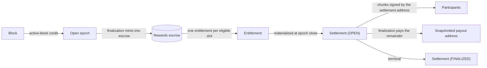

# Settlement (`x/mining`)

Settlement is how reward value leaves escrow. When `x/rewards` finalizes an epoch it
mints the epoch's emission into the rewards module account and records one
**entitlement** per eligible slot; the money stays there until `x/mining` releases it.
Settlement releases an entitlement through two kinds of transaction: **chunks**, which
pay a slot's participants, and **finalization**, which pays whatever is left to the
payout address snapshotted when the epoch closed and closes the obligation for good.

`x/mining` holds no bank keeper and no funds. Every transfer it authorizes is performed
by `x/rewards` against the entitlement that module owns, under that module's own
ceiling, so a defect in settlement cannot widen what leaves escrow. Consensus never pays
anyone on a timer: there is no automatic payout and no automatic finalization.

## Value flow

## From entitlement to settlement

In the same block that finalizes an epoch, the `x/mining` EndBlock materializes that
epoch's **settlement set**: one settlement row per entitlement, keyed `(slot, epoch)`,
created `OPEN` with chunk cursor `0` and bound to the distribution mode and settlement
parameters that govern the epoch. The set is written all at once, together with an
**epoch anchor** that records the settlement clock at creation; the materialization
cursor (`last_processed_reward_epoch`) advances only with the complete set. Rows are
write-once: an existing settlement is never recreated.

Materialization runs every block and looks exactly one epoch past its cursor, so it
costs the same however many epochs the chain has closed. If it ever found a finalized
epoch beyond the one it expected, it would fail the block rather than catch up: a
settlement materialized in a later block would be anchored to the wrong clock, which
would move every deadline derived from it.

## The settlement clock

Deadlines are not block heights. `x/mining` keeps a **settlement clock** that ticks once
per block whose beginning-of-block pause state permits release. A pause (an
emergency-authority action in `x/rewards`) therefore freezes every open window instead
of consuming it, and so does a halt: nothing expires while the chain is paused or down.
`mining-query settlement-clock` reads it.

A settlement's **deadline** is its epoch anchor's clock plus
`settlement_window_epochs × epoch_length_blocks` of its epoch — by default two epochs,
720 ticks at the 360-block epoch. Chunks are refused at and after the deadline;
finalization becomes permissionless from it. Transactions compare against the clock as
it stood at the end of the previous block.

## Modes

Each settlement carries a mode derived from the chain's distribution-mode history at its
epoch:

| Settlement mode | Chunks | Finalization |
|---|---|---|
| `TRUSTED_AS` — the current profile | the slot's settlement address may pay participants, up to the full entitlement, before the deadline | the settlement address before the deadline; anyone from the deadline on |
| `OPERATOR_ONLY` | none: the whole entitlement is the operator's | anyone, immediately |
| `SELECTED_PARTICIPANTS` | defined for a protocol-selection mode that has no producer in this version; an epoch bound to protocol selection is refused at materialization | — |

## Chunks

`tx mining submit-settlement-chunk` releases one batch of participant payouts against an
open settlement. It is admitted only if, in this order:

1. release is not paused — checked first, before the settlement is even read;
2. the settlement exists, is `OPEN`, and its mode permits chunks;
3. the signer is the slot's **settlement address** as recorded in CoreSlot. The slot's
   lifecycle status is deliberately not consulted: removal freezes that address, so a
   removed slot's earned settlements stay payable by whoever held the credential;
4. the clock is before the deadline;
5. `chunk_index` equals the settlement's `next_chunk_index` — a replay is a rejection,
   never a second payment — and that index is below `max_chunks_per_settlement`;
6. the chunk has at most `max_recipients_per_chunk` lines; each recipient is an
   ordinary account (not a module account or a blocked one — `mining-query
   validate-economic-address` applies the same rule), recipients are unique and in
   strictly ascending address-byte order, and each amount is at or above
   `min_recipient_payout_amount`;
7. released so far plus this chunk does not exceed the entitlement.

The transfers, the entitlement's released amount and the cursor advance commit together
or not at all. A caller that lost the response reads `next_chunk_index` back: `n+1`
means chunk `n` committed, `n` means retry it.

What the signer cannot do: exceed the entitlement, redirect the operator's remainder,
skip or reorder chunks, replay one, open a settlement, or move funds from escrow
directly. What it can do is the stated threat model: a compromised settlement credential
can direct participant payouts up to the full entitlement of every open settlement of
that slot. The responses are rotating the slot's settlement address (CoreSlot's
`MsgUpdateSettlementAddress`, see the
[CoreSlot operator guide](../operators/coreslot-operator-guide.md)) or a chain-wide
[pause](transactions.md#pause--resume).

## Finalization

`tx mining finalize-settlement` is the terminal transition. It pays the remainder —
the entitlement minus what chunks released — to the payout address snapshotted at epoch
close, records the outcome, and retires the row from the open index. The caller decides
only whether the transition happens now; the amount, the destination and the recorded
reason all come from state, and the message has no field for any of them. Live slot
status is not consulted: an entitlement earned in a closed epoch is never withheld by a
later suspension or removal.

Who may finalize follows the deadline, and the recorded reason names the
**authorization path**, not the caller:

| Reason | When | Who |
|---|---|---|
| `AUTHORIZED_EARLY` | before the deadline | the settlement address only. It forfeits the rest of the participant window, possibly having distributed nothing |
| `PERMISSIONLESS_AFTER_DEADLINE` | at or after the deadline | any account, the settlement address included |
| `PERMISSIONLESS_OPERATOR_ONLY` | immediately | any account (operator-only mode) |

A zero remainder finalizes without a transfer. Finalization is refused while paused.
There is no queue, sweep or retry: an open settlement may stay open indefinitely past
its deadline until someone submits the transaction, and the only thing the deadline
changes is who may do so.

## Parameters

| Parameter | Default | Bound |
|---|---|---|
| `settlement_window_epochs` | `2` | — |
| `max_recipients_per_chunk` | `32` | at most 32 |
| `max_chunks_per_settlement` | `4` | at most 4 |
| `min_recipient_payout_amount` | `10000` | at least 10,000 `utwlt`, an immutable floor |

Settlement parameters and the distribution mode are **versioned histories**: a version
becomes effective at an epoch boundary and governs epochs two ahead of it.
`mining-query settlement-params-for-epoch <epoch>` shows the binding epoch and the
version an epoch uses. A scheduled change is promoted in the EndBlock that closes the
epoch before it takes effect. In the current version no transaction schedules one; the
histories come from genesis or from an upgrade handler.

## Queries, transactions and events

| Command | Returns |
|---|---|
| `twilightd mining-query settlement <slot-id> <epoch>` | one row: mode, bound versions, `next_chunk_index`, `finalized`, `finalized_height`, `finalization_reason` |
| `twilightd mining-query open-settlements [slot-id]` | open settlements, per slot in ascending epoch (paginated) |
| `twilightd mining-query settlement-clock` | the clock |
| `twilightd mining-query settlement-params-for-epoch <epoch>` | the parameters an epoch binds, and its binding epoch |
| `twilightd mining-query settlement-params-version[s]`, `distribution-mode-version[s]`, `selection-params-version[s]` | the histories |
| `twilightd mining-query validate-economic-address <address>` | whether an address may receive a payout, and if not why |
| `twilightd tx mining submit-settlement-chunk --slot-id … --epoch … --chunk-index … --payouts <json>` | one `{"recipient","amount"}` object per line; signed by the slot's settlement address |
| `twilightd tx mining finalize-settlement --slot-id … --epoch …` | signed by whoever the arm permits |

Events: `mining_settlement_chunk_submitted` (`slot_id`, `epoch`, `chunk_index`,
`next_chunk_index`, `recipient_count`, `chunk_total`) and `mining_settlement_finalized`
(`slot_id`, `epoch`, `finalization_reason`, `released_remainder`, `finalized_height`).

The `x/rewards` side of the same obligation — the entitlement and its released amount —
is read with `rewards-query entitlement <slot-id> <epoch>` and
`rewards-query epoch-entitlements <epoch>`.
